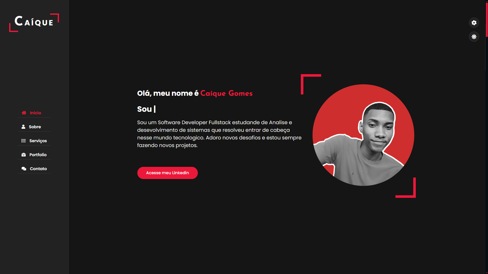

# CaiqueGomesDev Portfólio



Bem-vindo ao meu portfólio! Aqui você encontrará informações sobre meus projetos, habilidades e experiência como desenvolvedor de software. O objetivo deste portfólio é mostrar as tecnologias que utilizo, bem como os projetos que desenvolvi ao longo da minha carreira.

### Visite o site ao vivo

Seu site está online em: [https://caiquegomesdev.github.io/CaiqueGomesDevPortifolio/](https://caiquegomesdev.github.io/CaiqueGomesDevPortifolio/)

## Tecnologias Utilizadas

Este portfólio foi desenvolvido utilizando as seguintes tecnologias:

- HTML5
- CSS3
- JavaScript
- C#
- SCSS
- GitHub Pages (para hospedagem)
- Dentre outras tecnologias

## Projetos
Todos os projetos presentes no Portfolio poderão ser encontrados no meu Github.

## Como Rodar o Projeto Localmente

Se você deseja rodar este portfólio em seu computador, siga as instruções abaixo:

1. Clone este repositório:
   ```bash
   git clone https://github.com/caiquegomesdev/CaiqueGomesDevPortifolio.git

2. Navegue até a pasta do projeto:
   ```bash
    cd CaiqueGomesDevPortifolio
    Abra o arquivo index.html em seu navegador.

## Contribuições
Sinta-se à vontade para contribuir com este projeto! Para contribuir, faça um fork deste repositório, faça suas alterações e envie um pull request.

## Contato
Se você tiver alguma dúvida ou quiser entrar em contato comigo, você pode me encontrar em:

1. Email:
    ```bash
    caiquegomesdev@gmail.com
3. LinkedIn:
    ```bash
    https://www.linkedin.com/in/caique-gomes-dev/
## Obrigado por visitar meu portfólio! 🚀
